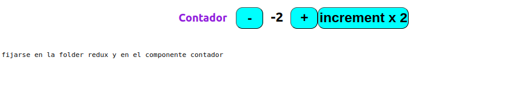

# Redux -Typecript

En este proyecto he dejado la forma de ejemplo de conectar react con redux usando typecript

- en Redux/reducer/CounterSlices usando redux/tookit (version mejorada)
- en Redux/reducer/CounterRedcuer usando redux con types |reducer| actios (version vieja)

El componente Contador esta comentado con las 3 formas de usarlo

- useState
- con slices es super resumido
- con action y types debes crear funciones donde hagas el dispatch (para mi es mas facil de entender , lo aprendi asi en su momento)



### store

- Dentro de la folder Redux/store/store.ts

El store lo configure directamente con reduxjs/tookit

- tiene un combineReducer

```javascript
import { configureStore, combineReducers } from "@reduxjs/toolkit";
import reducerContador from "../reducer/contador/CounterReducer";
import CounterSlices from "../reducer/contador/CounterSlices";
//si tengo varios reducer puedo combinarlos aca
const rootReducer = combineReducers({
  counterReducer: reducerContador, //es una forma de hacerlo al counter con Reducer
  counterSlices: CounterSlices, //es otra forma de hacerlo con el Slices
});

const store = configureStore({
  reducer: rootReducer,
});

/*
combineReducers se utiliza para combinar múltiples reducers en un solo reducer raíz.
RootState se define utilizando ReturnType<typeof rootReducer>, 
lo que significa que es el tipo del valor de retorno de rootReducer. 
En otras palabras, RootState representa el tipo del estado completo de la aplicación.

*/

export default store;

export type RootState = ReturnType<typeof rootReducer>;
```

### Provider

Debemos importar el provider y envolver la app

```javascript
import ReactDOM from "react-dom/client";
import "./index.css";
import App from "./App";

//==============importando =======================0
import { Provider } from "react-redux";
import store from "./Redux/store/store";

//=========================================
const root = ReactDOM.createRoot(
  document.getElementById("root") as HTMLElement
);
root.render(
  <Provider store={store}>
    <App
    />
  </Provider>
);

```

### Reducer

Dentro de Redux/reducer/

##### tenemos 2 formas de hacerlo : a traves de redux/toolkit con slices

CounterSlices.ts

```javascript
import { createSlice, PayloadAction } from "@reduxjs/toolkit";

const InitialState = {
  count: 0,
};

const CounterSlices = createSlice({
  name: "counter",
  initialState: InitialState,
  reducers: {
    increment: (state) => {
      state.count = state.count + 1;
    },
    decrement: (state) => {
      state.count = state.count - 1;
    },
    // Ejemplo con PayloadAction si necesitas pasar datos a la acción
    incrementByAmount: (state, action: PayloadAction<number>) => {
      state.count += action.payload;
    },
  },
});

export const { decrement, increment, incrementByAmount } =
  CounterSlices.actions;
export default CounterSlices.reducer;
```

##### Sino usar el metodo viejo con crear una funcion con switch

Tenemos que tener una interface por los tipos

Types.ts

```javascript
export interface InitialStateCount {
  count: number;
}

export const CounterTypes = {
  INCREMENT: "INCREMENT",
  DECREMENT: "DECREMENT",
  INCREMENT_BY_AMOUNT: "INCREMENT_BY_AMOUNT",
};
```

CounterReducer.ts

```javascript
import { PayloadAction } from "@reduxjs/toolkit";
import { InitialStateCount, CounterTypes } from "../../Types";

const InitialState: InitialStateCount = {
  count: 0,
};

const reducerCounter = (
  state = InitialState,
  action: PayloadAction<number>
) => {
  switch (action.type) {
    case CounterTypes.INCREMENT:
      return {
        count: state.count + 1,
      };

    case CounterTypes.DECREMENT:
      return {
        count: state.count - 1,
      };
    case CounterTypes.INCREMENT_BY_AMOUNT:
      return {
        count: state.count + action.payload,
      };

    default:
      return state;
  }
};

export default reducerCounter;
```

### component

Dentro de components creamos un archivo llamado Contador.ts

```javascript
import React from "react";
import { useDispatch, useSelector } from "react-redux";
import { RootState } from "../Redux/store/store";

//============  estos metodos de usan con CounterSlices==============================0
import {
  increment,
  decrement,
  incrementByAmount,
} from "../Redux/reducer/contador/CounterSlices";

//importamos los Tipos para usar con la version CounterReducer
import { CounterTypes } from "../Redux/Types";

import { Dispatch } from "@reduxjs/toolkit"; //el tipo
const Contador = () => {
  /**
   ==========metodo viejo cin redux con useSate=============
  const [contador, SetContador] = useState(0);
  const handleIncrement = () => SetContador(contador + 1);
 */

  //metodo con redux/slices
  // const contador = useSelector((state: RootState) => state.counterSlices.count);

  //metodo con redux/reducer
  const contador2 = useSelector(
    (state: RootState) => state.counterReducer.count
  );

  const dispatch: Dispatch = useDispatch();

  return (
    <>
      <div className="" style={{ display: "flex", justifyContent: "center" }}>
        <h2 style={{ color: "blueviolet", margin: "10px 20px" }}>Contador</h2>
        <div style={{ display: "flex" }}>
          <button
            type="button"
            style={{
              backgroundColor: "cyan",
              padding: "4px 0",
              width: "60px",
              borderRadius: "15px",
              fontWeight: "bold",
              fontSize: "30px",
            }}
            //   onClick={() => SetContador(contador - 1)} //con useState()
            //onClick={() => dispatch(decrement())}  //con Slices

            //con Reducer y switch
            onClick={() =>
              dispatch({
                type: CounterTypes.DECREMENT,
              })
            }
          >
            -
          </button>
          <span
            style={{
              padding: "4px 0",
              width: "60px",
              borderRadius: "15px",
              fontWeight: "bold",
              fontSize: "30px",
              textAlign: "center",
            }}
          >
            {contador2}
          </span>
          <button
            type="button"
            style={{
              backgroundColor: "cyan",
              padding: "4px 0",
              width: "60px",
              borderRadius: "15px",
              fontWeight: "bold",
              fontSize: "30px",
            }}
            //onClick={() => SetContador(contador + 1)} //con useState()
            //onClick={() => dispatch(increment())}  //con Slices

            //con Reducer y switch
            onClick={() =>
              dispatch({
                type: CounterTypes.INCREMENT,
              })
            }
          >
            +
          </button>

          <button
            type="button"
            style={{
              backgroundColor: "cyan",
              padding: "4px 0",
              width: "200px",
              borderRadius: "15px",
              fontWeight: "bold",
              fontSize: "30px",
            }}
            //onClick={() => SetContador(contador + 1)} //con useState()
            //  onClick={() => dispatch(incrementByAmount(2))} //con Slices

            //con Reducer y switch
            onClick={() =>
              dispatch({
                type: CounterTypes.INCREMENT_BY_AMOUNT,
                payload: 2,
              })
            }
          >
            increment x 2
          </button>
        </div>
      </div>
    </>
  );
};

export default Contador;
```

### documentacion en [Redux](https://redux.js.org/)
